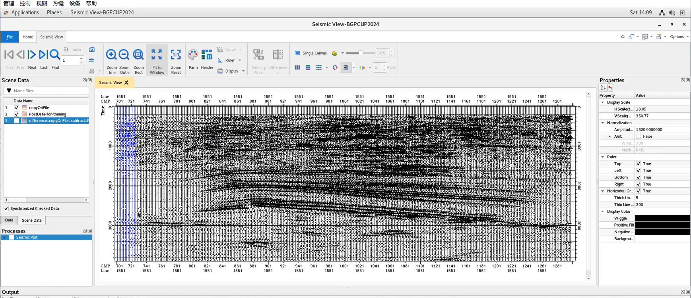
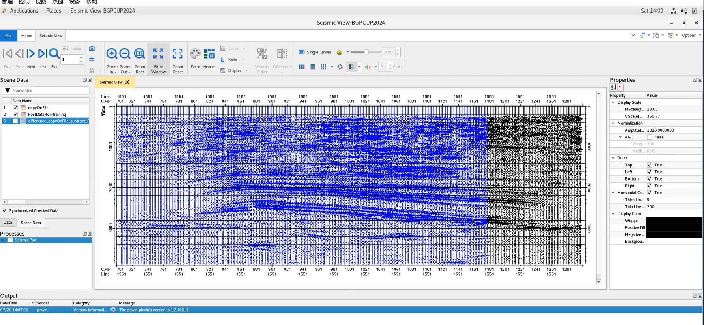
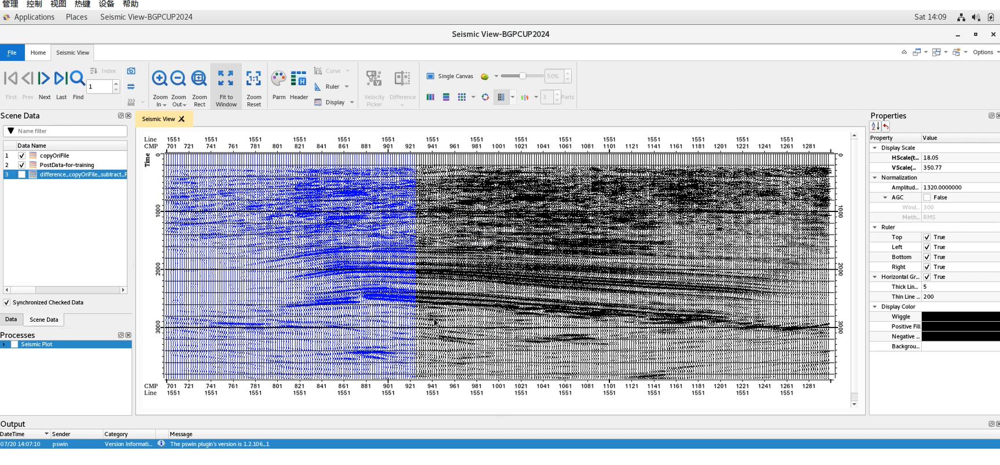
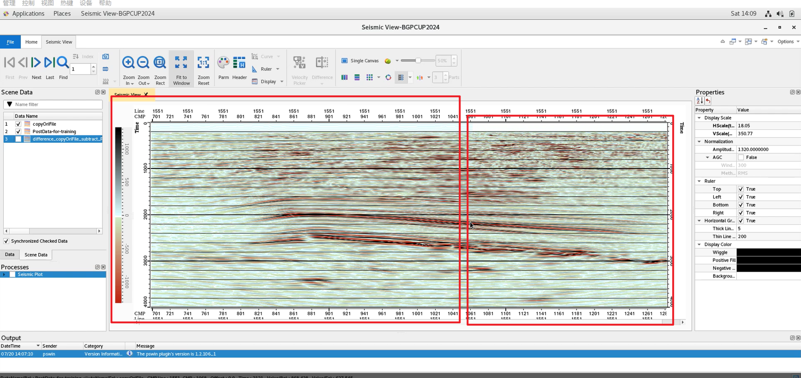
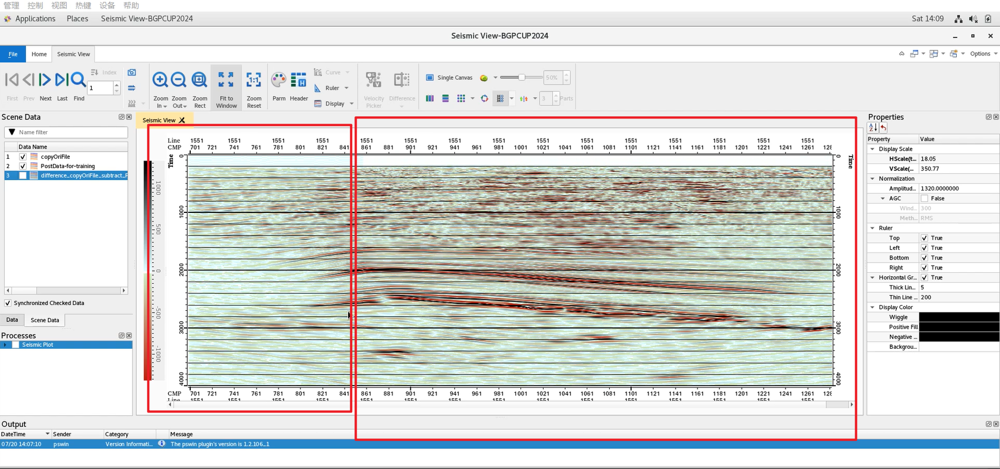

# 视觉无损压缩
### 环境
python 3.11

### 启动
在主函数中使用 fun_main 函数，或者 main 函数，main 函数是命令行的形式

- fun_main 函数：
1. 压缩算法 1
    - ori_file  需要压缩的文件（需要符合 n_trace * interval 格式）
    - comp_file 压缩文件 
    - output_file  解压缩文件
    -  downsample_factor = 3   降采样因子
    - compression_PCArate = 0.95   pca 保留 95% 的特征
    - start_trace = 0 起始道
    - end_trace = 210000  终止道
    - interval = 2001 每道采样点个数 

2. 压缩算法2
    - chunk_size = end_trace // 100 分批次处理
    - shorld = 0.1 傅里叶变换的阈值

### 原理

1. 压缩算法1
   
pca主成分分析降维 --> 降采样 --> 32位量化为8位 --> zip压缩
2. 压缩算法2
    
傅里叶变换截断 --> 量化 --> zip压缩 

### 效果
130倍压缩
### 图片展示
geoeast上打开，
鼠标右侧是原始数据，左侧是处理后的数据

